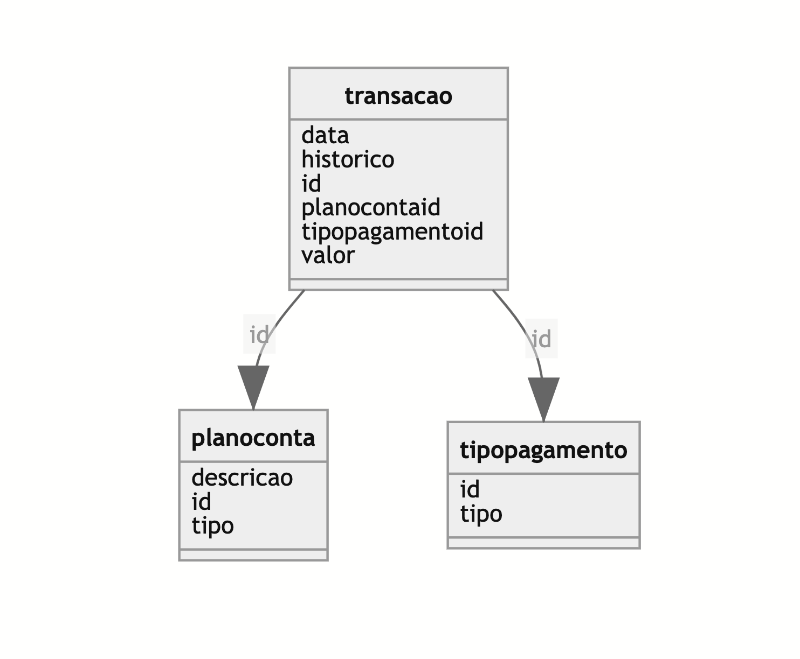

# myfinance-web-dotnet
MyFinance Web - Controle de Finanças Pessoais

## DER - Diagrama de Entidade e Relacionamento

## Protótipo

## Contribuições

1. Fork this repository.
2. Create a branch: `git checkout -b <branch_name>`.
3. Make your changes and confirm them: `git commit -m '<commit_message>'`
4. Send to original branch: `git push origin <project_name> / <local>`
5. Create pull request.

[⬆ Back to top](#myfinance-web-dotnet) 